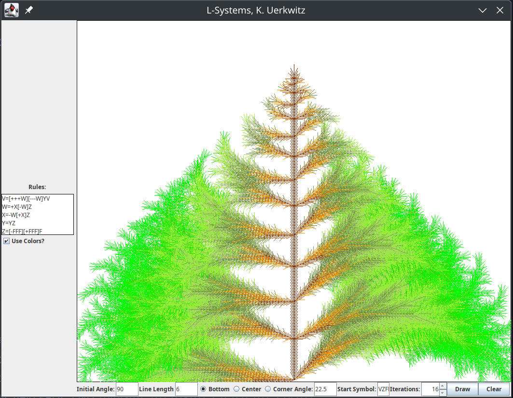

# javaLindenmeyer, an L-Systems Exploration



This project was originally written in Java 8, but should still be compatible with later Java versions.

Using the Java Swing GUI, and a turtle graphics drawing implementation, this project explores the L-Systems of the [Lindenmeyer System](https://en.wikipedia.org/wiki/L-system).

An L-System is a set of rules that define how a symbol is expanded into a sequence of other symbols. The rules are applied recursively until a fixed point is reached, and the resulting sequence is the output of the L-System.

L-Systems have been used in computer graphics to generate fractal patterns, and have also been used in natural language processing to generate text.

## Features

## How to Use

### Git Clone the Repository

To clone the repository, run the following command in your terminal:

```bash
git clone https://github.com/uerkw/javaLindenmeyer.git
```

### Run the Project

If you have Java installed, you can run the project by navigating to the project directory and running the following command:

```bash
javac -d bin src/com/kuerkwitz/Lsystem/UI/Project2GUI.java
java -cp bin com.kuerkwitz.Lsystem.UI.Project2GUI
```

This project was tested with Java 8 and Java 17, and should work with any Java version that supports JavaFX.

### Entering L-System Rules

The L-System rules are entered in the text area on the left side of the GUI.
Each rule is a single character, and is separated by a `=` sign. The rules are applied in the order they are entered.
Rules can be found [here](https://paulbourke.net/fractals/lsys/), or in the "Examples of L-Systems" section of the Wikipedia article.

Use the initial angle and line length fields to adjust the starting angle and length of the lines.

The "Iterations" field determines how many times the rules are applied to the starting symbol.

The "Start Symbol" field determines the symbol that is used to start the expansion of the rules.

### Colors

Because L-Systems are commonly used to generate plant-like structures, an option is provided to use colors in the drawing.
To enable colors, check the "Use Colors?" checkbox.
The colors are a predefined set of colors, and can be changed by editing the `DisplayGraphics.java` file.

## How to Contribute

Contributions are welcome! If you have any suggestions or improvements, please open an issue or submit a pull request.
